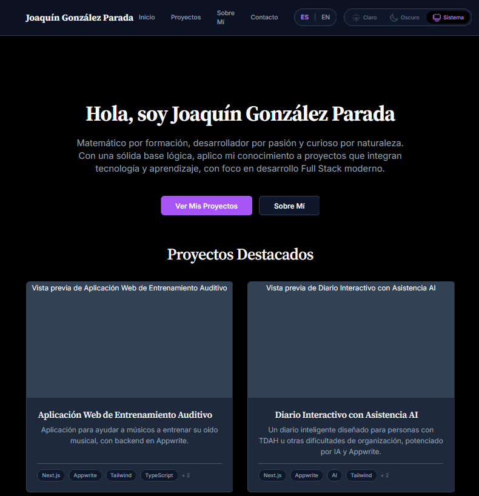

# Joaquín González Parada - Portfolio

Este es mi portafolio personal, desarrollado para mostrar mis proyectos, habilidades y experiencia como desarrollador Full Stack. El sitio está construido utilizando tecnologías web modernas con un enfoque en rendimiento, accesibilidad y buenas prácticas de desarrollo.

**[➡️ Ver Demo en Vivo](https://portfolio-nextjs-six-vert.vercel.app/)**


*(Reemplaza `public/images/portfolio-screenshot.png` con la ruta real a una captura de pantalla después de añadirla)*

---

## ✨ Características Principales

* **Navegación Intuitiva:** Secciones claras para Inicio, Proyectos, Sobre Mí y Contacto.
* **Listado de Proyectos:** Muestra proyectos personales y académicos con detalles, stack tecnológico y enlaces (Demo/Código).
* **Detalle de Proyecto:** Páginas dedicadas para cada proyecto con descripción ampliada, imágenes, estado de desarrollo (si aplica).
* **Página "Sobre Mí":** Presentación personal, cita, listado de habilidades técnicas y blandas, experiencia y formación.
* **Formulario de Contacto:** Funcionalidad para enviar mensajes directamente (implementado con Server Actions).
* **Tematización (Theming):** Soporte para modos Claro, Oscuro y seguimiento del Sistema Operativo.
* **Internacionalización (i18n):** Soporte básico para Español e Inglés con cambio de idioma.
* **Diseño Responsivo:** Adaptado para una visualización óptima en diferentes tamaños de pantalla (móvil, tablet, escritorio).
* **Accesibilidad:** Consideraciones de accesibilidad implementadas (semántica HTML, atributos ARIA, navegación por teclado, skip link, contraste).

## 🚀 Stack Tecnológico

* **Framework:** [Next.js](https://nextjs.org/) 14+ (App Router)
* **Lenguaje:** [TypeScript](https://www.typescriptlang.org/)
* **UI:** [React](https://reactjs.org/) 18+
* **Estilos:** [Tailwind CSS](https://tailwindcss.com/) v3+ (con variables CSS para theming)
* **Componentes UI:** Construidos a medida, `class-variance-authority` + `clsx` + `tailwind-merge`
* **Iconos:** [Lucide React](https://lucide.dev/)
* **Validación (Formulario):** [Zod](https://zod.dev/)
* **Contenedorización:** [Docker](https://www.docker.com/)
* **CI/CD:** [GitHub Actions](https://github.com/features/actions)
* **Registro de Imágenes:** [GitHub Container Registry (ghcr.io)](https://docs.github.com/en/packages/working-with-a-github-packages-registry/working-with-the-container-registry)
* **Despliegue:** [Vercel](https://vercel.com/) (Desplegando la imagen Docker desde GHCR)

## 🛠️ Empezar (Correr Localmente)

Sigue estos pasos para configurar y ejecutar el proyecto en tu máquina local.

### Prerrequisitos

* [Node.js](https://nodejs.org/) (v20.x o superior recomendado)
* [Yarn](https://yarnpkg.com/) (o `npm`/`pnpm`)
* [Git](https://git-scm.com/)

### Instalación

1.  **Clona el repositorio:**
    ```bash
    git clone [https://github.com/j-gonzalezp/portfolio-nextjs.git](https://github.com/j-gonzalezp/portfolio-nextjs.git)
    cd portfolio-nextjs
    ```
2.  **Instala las dependencias:**
    ```bash
    yarn install
    # o: npm install
    # o: pnpm install
    ```
3.  **Configura las Variables de Entorno:**
    * Crea un archivo `.env.local` en la raíz del proyecto.
    * Añade la siguiente variable (necesaria para `generateMetadata` y desarrollo local):
        ```env
        # .env.local
        NEXT_PUBLIC_BASE_URL=http://localhost:3000
        ```
    * *Nota:* El archivo `.env.local` está incluido en `.gitignore` y no debe ser subido a Git.
4.  **Ejecuta el servidor de desarrollo:**
    ```bash
    yarn dev
    # o: npm run dev
    # o: pnpm dev
    ```
5.  Abre [http://localhost:3000](http://localhost:3000) en tu navegador para ver el resultado.

## 🚢 Despliegue

Este proyecto está configurado para despliegue continuo usando:

1.  **GitHub Actions:** Al hacer push a la rama `main`, se activa un workflow (`.github/workflows/docker-publish.yml`).
2.  **Docker Build:** El workflow construye una imagen Docker optimizada usando la salida `standalone` de Next.js.
3.  **GitHub Container Registry (ghcr.io):** La imagen Docker construida se publica en GHCR.
4.  **Vercel:** Vercel está configurado para detectar nuevas imágenes en GHCR (con la etiqueta `latest`) y desplegar automáticamente el contenedor.

Las variables de entorno requeridas en producción (como `NEXT_PUBLIC_BASE_URL` con la URL pública) deben configurarse directamente en el panel de Vercel.

## 📂 Estructura del Proyecto (Simplificada)
portfolio-nextjs/
├── .github/workflows/      # Workflows de GitHub Actions (CI/CD)
├── .husky/                 # Configuración de Git Hooks (linting/formatting pre-commit)
├── app/                    # Next.js App Router (Páginas, Layouts, Contextos, Componentes específicos)
│   ├── (routes)/           # Carpetas para cada ruta (e.g., about/, contact/, projects/)
│   ├── components/         # Componentes UI reutilizables (layout, ui, features)
│   ├── contexts/           # React Contexts (Theme, Locale)
│   ├── layout.tsx          # Layout raíz
│   ├── page.tsx            # Página de inicio (Home)
│   └── globals.css         # Estilos globales y variables CSS
├── content/                # Contenido estático (datos de proyectos)
│   └── projects/
│       └── data.ts         # Datos de los proyectos
├── lib/                    # Funciones de utilidad, constantes, lógica compartida
│   ├── constants.ts        # URLs, valores fijos
│   ├── projects.ts         # Lógica para obtener y procesar datos de proyectos
│   ├── translations.ts     # Textos para i18n
│   └── utils.ts            # Utilidades generales (ej. cn)
├── public/                 # Archivos estáticos (imágenes, fuentes, etc.)
│   └── images/             # Imágenes de proyectos, placeholders
├── .dockerignore           # Archivos a ignorar por Docker
├── .env.local              # Variables de entorno locales (¡NO SUBIR A GIT!)
├── .gitignore              # Archivos a ignorar por Git
├── Dockerfile              # Instrucciones para construir la imagen Docker
├── next.config.js          # Configuración de Next.js (output: standalone)
├── package.json            # Dependencias y scripts
├── postcss.config.mjs      # Configuración de PostCSS (para Tailwind)
├── tailwind.config.ts      # Configuración de Tailwind CSS
├── tsconfig.json           # Configuración de TypeScript
└── README.md               # Este archivo

